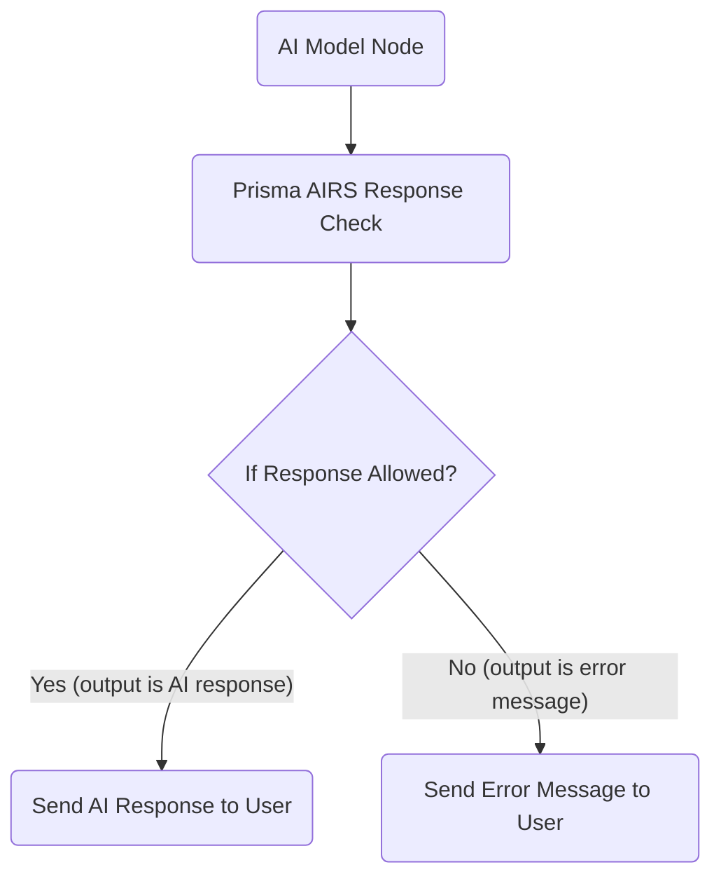

# n8n-nodes-prismaairs

This is an n8n community node for integrating with Palo Alto Networks AIRS (AI Security) to perform both prompt and response content checks.

## Features

* **PrismaAIRSPromptCheck**: Validates user prompts against various security policies (e.g., prompt injection, sensitive data, toxic content, malicious URLs, agent attacks).

* **PrismaAIRSResponseCheck**: Validates AI model responses against security policies (e.g., sensitive data, toxic content, ungrounded responses, malicious URLs, database security issues).

## Installation

To install this node, you can use the n8n command line interface. First, navigate to your n8n custom nodes directory (typically `~/.n8n` or the directory where your n8n instance is running):

```
cd ~/.n8n # Or your n8n installation directory
npm install n8n-nodes-prismaairs

```

Alternatively, you can install it directly from the n8n UI:

1. Open your n8n instance in your web browser.

2. Go to **Settings** (gear icon in the left sidebar) > **Community Nodes**.

3. Click the **Install** button.

4. In the "npm package name" field, enter `n8n-nodes-prismaairs`.

5. Click **Install**.

After installation, restart your n8n instance to ensure the new nodes are loaded.

## Credentials Setup

Both `PrismaAIRSPromptCheck` and `PrismaAIRSResponseCheck` nodes require an API Key for authentication with the Palo Alto Networks AIRS API.

To set up the credential:

1. In your n8n instance, click on **Credentials** in the left sidebar.

2. Click the **New Credential** button.

3. In the search bar, type "Prisma AIRS API" and select it from the list.

4. A new credential form will appear. In the "API Key" field, enter your actual Palo Alto Networks AIRS API Key.

5. Click **Save**.

You can now select this credential when configuring your Prisma AIRS nodes in your workflows.

## Usage

### PrismaAIRSPromptCheck Node

This node is designed to scan incoming prompts from users *before* they are sent to an AI model, helping to prevent malicious or unwanted inputs.

**Node Parameters:**

* **Session ID (Required)**: A unique identifier for the current chat session. This helps AIRS track the conversation context.

  * *Example Value*: `{{ $json.sessionId }}` (if your trigger provides a `sessionId`)

* **Chat Input (Prompt) (Required)**: The actual text of the user's prompt that needs to be checked.

  * *Example Value*: `{{ $json.chatInput }}` (if your trigger provides `chatInput`)

* **AI Profile Name**: The name of the AI profile configured in your Prisma AIRS dashboard specifically for *input* scanning.

  * *Default Value*: `Demo-Profile-for-Input`

* **AI Model Name**: The name of the AI model you are using (e.g., Claude-3.5, GPT-4).

  * *Default Value*: `Claude-3.5`

* **Context**: Additional context for the prompt, which AIRS can use for more accurate contextual analysis (e.g., defining the scope of the AI's allowed responses).

  * *Default Value*: `only talk about Palo Alto networks equipment`

**Output Behavior:**

* **If the prompt passes all security checks (`action: "allow"`)**: The node will return an item containing the original `sessionId`, `action: "allow"`, and `chatInput`. This allows your workflow to proceed and send the prompt to your AI model.

  ```json
  {
    "sessionId": "your-session-id",
    "action": "allow",
    "chatInput": "Your original prompt"
  }
  
  ```

* **If** a security issue is detected **(`action: "block"`)**: The node will return an item with an `output` property containing a descriptive error message, indicating why the prompt was blocked.

  ```json
  {
    "output": "Palo Alto Networks AIRS detected a Prompt Injection Attack. Please redefine your questions"
  }
  
  ```

  Possible block messages include:

  * `Palo Alto Networks AIRS detected an Agent Attack. Please redefine your questions`

  * `Palo Alto Networks AIRS detected that there is sensitive data in your request, please try again with another question`

  * `Palo Alto Networks AIRS detected a Prompt Injection Attack. Please redefine your questions`

  * `Palo Alto Networks AIRS detected some unacceptable content. Please redefine your questions`

  * `Palo Alto Networks AIRS detected unacceptable URL. Please redefine your questions`

  * `Error calling Prisma AIRS API: [error message]` (for API communication errors)

**Example Workflow Snippet for Prompt Check:**

```mermaid
graph TD
    A[Trigger (e.g., Webhook, Chat Input)] --> B(Prisma AIRS Prompt Check);
    B --> C{If Prompt Allowed?};
    C -- Yes (action == 'allow') --> D(Send Prompt to AI Model);
    C -- No (output exists) --> E(Send Error Message to User);

```

### PrismaAIRSResponseCheck Node

This node is designed to scan responses generated by an AI model *before* they are sent back to the user, ensuring the AI's output is safe and compliant.

**Node Parameters:**

* **Session ID (Required)**: A unique identifier for the current chat session. This helps AIRS track the conversation context.

  * *Example Value*: `{{ $json.sessionId }}`

* **AI Output (Response) (Required)**: The actual text of the AI model's response that needs to be checked.

  * *Example Value*: `{{ $json.output }}` (if your AI model node outputs to `output`)

* **AI Profile Name**: The name of the AI profile configured in your Prisma AIRS dashboard specifically for *output* scanning.

  * *Default Value*: `Demo-Profile-for-Output`

* **AI Model Name**: The name of the AI model that generated the response.

  * *Default Value*: `Claude-3.5`

* **Context**: Additional context for the response, which AIRS can use for more accurate contextual analysis.

  * *Default Value*: `only talk about Palo Alto networks equipment`

**Output Behavior:**

* **If the response passes all security checks (`action: "allow"`)**: The node will return an item containing the original `output` from the AI model. This allows your workflow to proceed and send the safe response to the user.

  ```json
  {
    "output": "Your AI's safe response"
  }
  
  ```

* **If** a security issue is detected **(`action: "block"`)**: The node will return an item with an `output` property containing a descriptive error message, indicating why the response was blocked.

  ```json
  {
    "output": "Palo Alto Networks AIRS detected an off topic response. Please redefine your questions"
  }
  
  ```

  Possible block messages include:

  * `Palo Alto Networks AIRS detected a database security issue in the response. Please redefine your questions`

  * `Palo Alto Networks AIRS detected that there is sensitive data in the response, please try again with another question`

  * `Palo Alto Networks AIRS detected an off topic response. Please redefine your questions`

  * `Palo Alto Networks AIRS detected some unacceptable content in the response. Please redefine your questions`

  * `Palo Alto Networks AIRS detected unacceptable URL in the response. Please redefine your questions`

  * `Error calling Prisma AIRS API: [error message]` (for API communication errors)

**Example** Workflow **Snippet for Response Check:**



## Development

If you wish to contribute to or modify this node locally:

1. **Clone the repository**:

   ```
   git clone [https://github.com/your-github-username/n8n-nodes-prismaairs.git](https://github.com/your-github-username/n8n-nodes-prismaairs.git)
   cd n8n-nodes-prismaairs
   
   ```

   *(Remember to replace `your-github-username` with your actual GitHub username.)*

2. **Install dependencies**:

   ```
   npm install
   
   ```

3. **Build the project**: This compiles the TypeScript files into JavaScript.

   ```
   npm run build
   
   ```

4. **Link** the node **to your n8n instance for local development**:

   ```
   npm link
   cd ~/.n8n # Or your n8n installation directory
   npm link n8n-nodes-prismaairs
   
   ```

   This creates a symbolic link, so changes in your development directory are reflected in your n8n instance without re-installing.

5. **Restart n8n** to load the new node.

For continuous development, you can use `npm run dev` in your node's project directory. This will watch for changes in your TypeScript files and automatically recompile them.

## Contributing

Feel free to open issues or submit pull requests if you have suggestions or improvements! Your contributions are welcome.

## License

This project is licensed under the MIT License.
